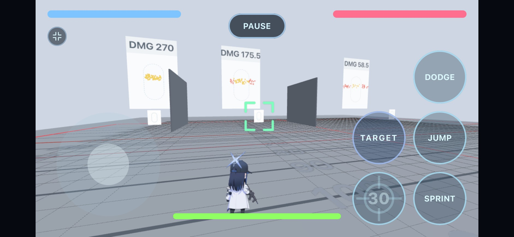
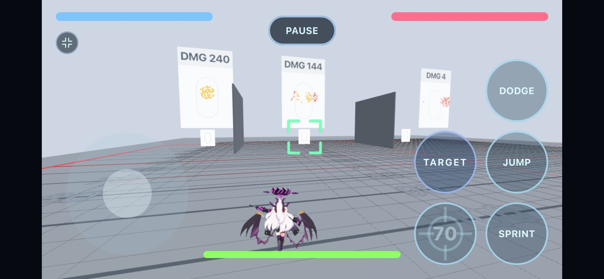
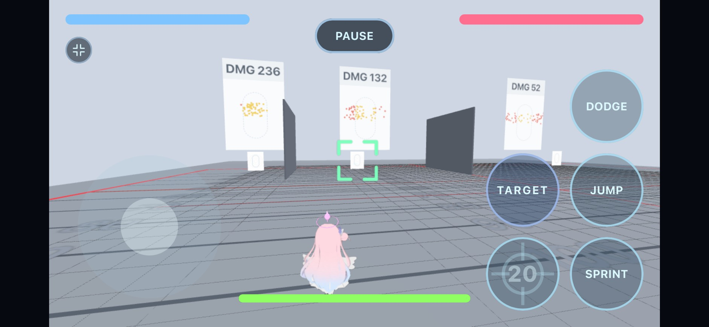
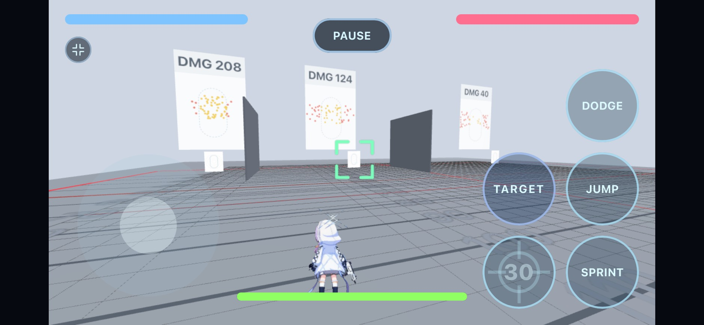
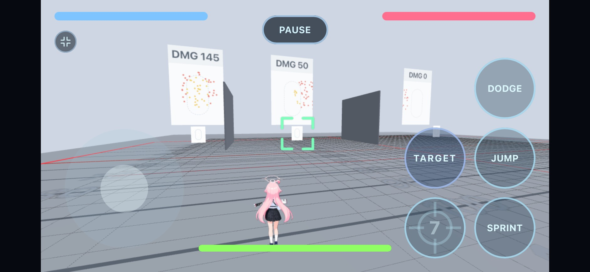

# Gun VS Gun

A fast-paced 1v1 / 2v2 duel prototype. Auto-aim — no manual targeting. The fight is about resource management: when to sprint, when to dodge, when to break line of sight, when to fire.

## Modes

### Offline
- **1v1**: you vs one enemy bot.
- **2v2**: you + an ally bot vs two enemy bots. Friendly fire is off between teammates.
- Optional "Dummy" mode on the map-select screen — zeroes out damage from every bot (enemies and your ally), so you can practice movement and observe bot behaviour without dying.

### Online
- **1v1**: the host presses **Start Match** when ready. The opponent slot holds a bot (default **Saori / Unit 1**) until a second human queues in and takes it — start early to play the bot, or wait for a player.
- **2v2**: host picks `2v2` on connect, then presses **Start Match** when ready; empty player slots fill with bots. Up to four humans can play (any split between teams); bots fill any remaining slots.
- **Bot unit selection**: in the lobby, the host can tap any bot slot to pick which unit that bot plays (1v1 and 2v2). A human joining the slot always overrides the bot.
- Multi-lobby — when an existing lobby is full or running, new joiners spawn their own lobby and become host.
- Team swap in 2v2: any non-host player can `Join` an empty slot to switch teams (e.g. two humans want to co-op on one side against two bots).

## Units

Twelve pickable units, near-identical base stats (150 HP, 250 boost, 16 walk, 11.76 sprint base — Unit 5 walks at 8, Unit 12 at 12; Unit 7 flies):

**Weapons:**

| | Mag | Damage | Fire rate | Projectile speed | Lock range | Reload |
|---|---|---|---|---|---|---|
| Unit 1 — Assault Rifle (Saori) | 30 | 4.5 / shot | ~850 RPM | 600 | 56 | 1.5 s |
| Unit 9 — Assault Rifle (Asuna) | 25 | 4 / shot | ~900 RPM | 600 | 56 | 1.5 s |
| Unit 4 — Submachine Gun (Atsuko) | 30 | 4 / shot | ~1100 RPM | 600 | 50 | 1.5 s |
| Unit 8 — Submachine Gun (Mika) | 50 | 4 / shot | ~600 RPM | 600 | 50 | 1.5 s |
| Unit 2 — Shotgun (Hoshino) | 7 | 5 × 8 pellets | ~250 RPM | 300 | 40 | 1.2 s (auto, per round) |
| Unit 11 — Shotgun (Haruka) | 7 | 5 × 8 pellets | ~250 RPM | 300 | 40 | 1.2 s (auto, per round) |
| Unit 12 — Machine Gun (Koyuki) | 100 | 4 / shot | ~650 RPM | 600 | 80 | 5 s |
| Unit 5 — Machine Gun (Hina) | 250 | 4 / shot | ~1200 RPM | 600 | 80 | 7 s |
| Unit 10 — Rifle (Fubuki) | 30 | 10 / shot | ~250 RPM | 600 | 56 | 2 s |
| Unit 7 — Rifle (Aris) | 8 | 15 / bolt | ~250 RPM | 600 | 56 | 1.2 s (auto, per round) |
| Unit 3 — Sniper Rifle (Aru) | 5 | 50 / 35 / 20 by range | 60 RPM | 2000 | 120 | 2.5 s + 1 s charge |
| Unit 6 — Laser Sniper (Kei) | 5 | 30 / beam (charged sweep: 20) | 60 RPM | instant (hitscan) | 120 | 2.5 s + 1 s charge |

**Handling (stun + spread):**

| | Stun | Spread (SA) | Horizontal spread (HA) | Sure-hit vs standing |
|---|---|---|---|---|
| Unit 1 — Saori | 100 ms @ 0.25 | 0.02 | 0.04 | ~53 |
| Unit 9 — Asuna | 100 ms @ 0.25 | 0.02 | 0.04 | ~53 |
| Unit 4 — Atsuko | 50 ms @ 0.50 | 0.06 | 0.04 | ~32 |
| Unit 8 — Mika | 50 ms @ 0.50 | 0.04 | 0.04 | ~40 |
| Unit 2 — Hoshino | 100 ms @ 0.25 | pattern (see below) | — | pattern |
| Unit 11 — Haruka | 100 ms @ 0.25 | pattern, 1.4× wide (see below) | — | pattern |
| Unit 12 — Koyuki | 100 ms @ 0.25 | 0.04 | 0.04 | ~40 |
| Unit 5 — Hina | 50 ms @ 0.85 | 0.04 | — | ~80 |
| Unit 10 — Fubuki | 100 ms @ 0.25 | 0.02 | — | ~160 |
| Unit 7 — Aris | 100 ms @ 0.25 | 0.02 | — | ~160 |
| Unit 3 — Aru | 100 ms @ 0.25 | 0.02 | — | ~160 |
| Unit 6 — Kei | 100 ms @ 0.25 | — (beam) | — | instant |

Unit 8 trades burst for uptime: modest burst DPS, but 200 damage per magazine and ~5.5 s of uninterrupted fire where most others reload every ~2 s.

**Reading the stun column** (`duration @ move-scale`): every landed hit slows the victim's movement to *move-scale* for *duration* — 0.25 means crawling at 25% speed for 100 ms. Each new hit refreshes it; when two stuns compete, the heavier slow (lower scale) wins.

**Reading the spread columns:** both are random cone angles in radians. **SA** is a perfectly ROUND random cone (equal scatter in both axes); **HA** adds extra scatter on the *horizontal axis only* — the axis enemies dodge along — so HA is pure anti-dodge coverage with no vertical waste. Total horizontal cone = SA + HA. Since angular error grows with distance, each gun has a **sure-hit range** against a stationary target (≈ 3.2 ÷ (SA + HA)); beyond it, hit chance falls off roughly as sure-hit ÷ distance. Wide-HA guns (Atsuko, Mika) deliberately trade standing-target accuracy at range for taxing dodgers. The shotguns ignore the cones entirely: their pellets fly a fixed 8-point pattern that opens toward ~5.8 wide over the first 70 units of flight — at lock range it is still a tight ~3.3-wide cluster; Haruka's pattern is additionally stretched 1.4× horizontally (details below).

**Preferred engage distance:** every unit's fighting range is its **lock range ± 7** — the band where bots hold position, orbit, and fire (shotgun 33–47, SMGs 43–57, snipers 113–127). One rule for all weapons: retune a lock range and the combat distance follows.

**Measured hit rates** (Shooting Range, shooter standing still at 50 units, 60 shots per target — Hoshino 7 blasts = 56 pellets):

| @50 units | Stationary | Walk (16 u/s) | Sprint (27.8 u/s) |
|---|---|---|---|
| Saori (4.5 dmg, SA.02+HA.04) | 60/60 — **100%** | 39 — 65% | 13 — 22% |
| Hina (4 dmg, SA.04, HA 0) | 60/60 — **100%** | 36 — 60% | **1 — 1.7%** |
| Mika (4 dmg, SA.04+HA.04) | 59 — 98% | 33 — 55% | 13 — 22% |
| Atsuko (4 dmg, SA.06+HA.04) | 52 — 87% | 31 — 52% | 10 — 17% |
| Hoshino (5/pellet, 56 pellets) | 29 — 52% | 10 — 18% | **0** |

The HA guns all hold 17–22% against the sprinter while HA-0 Hina lands ~2% — the anti-dodge role of HA in one row. Note Hoshino was tested well beyond her band (lock 40): at 50 the cluster is ~71% open and the 0.17 s flight lets a sprinter displace ~4.6 units, so whole blasts whiff.

*Test environment:* Shooting Range (offline practice map). The shooter stands on the 50-unit line and empties the shot count into each lane in turn; the sliders ping-pong along their trails at true in-sim speeds (walk 16, walk+sprint 27.8). Screens accumulate per-lane damage and grouping — **yellow dots are hits** (plotted at the impact point), **red dots are misses** (plotted where the shot crosses the sign plane). Left screen = stationary lane, middle = walk, right = sprint. Hit counts in the table are the screen damage ÷ per-hit damage.

| | |
|---|---|
| **Saori** — 270 / 175.5 / 58.5  | **Hina** — 240 / 144 / 4  |
| **Mika** — 236 / 132 / 52  | **Atsuko** — 208 / 124 / 40  |
| **Hoshino** — 145 / 50 / 0  | |

Projectiles fly straight (homing is zeroed universally); red-lock is an in-range indicator.

### Units 2 & 11 — the shotgun blast

- A trigger pull fires **one flying pellet cluster** carrying a fixed 8-point pattern (randomly rotated each shot, so no two blasts look alike while the spacing geometry never clumps). Each pellet keeps its **own hitbox** and dies individually on walls or the target; damage = pellets landed × 5 (all 8 point-blank = 40, both shotguns).
- The pattern leaves the muzzle bunched and grows toward full width (~5.8 across) over the first **70 units** of flight. At lock range (40) it is ~57% open (~3.3 across), so locked-fire blasts land as a concentrated cluster rather than a full spread.
- **Haruka's wide fan (Unit 11):** her pattern is stretched **1.4× horizontally** after the per-shot rotation — the cloud is 1.4× wider and exactly as tall as Hoshino's (at lock 40: ~4.6 × 3.3; fully open: ~8.1 × 5.8). More graze coverage along the dodge axis, lighter pellets — the dodge-catcher to Hoshino's concentrated slug.
- One blast = one simulated/networked object instead of 8, which is what fixed the online "shotgun lag".

### Aris (Unit 7) — flight & laser bolts

- **Flight kit**: a jump tap in the air re-fires the jump impulse (12 boost per pop, no cooldown); *holding* jump sustains a climb at sprint speed; air-sprint flies **level** (dedicated fly art); the air-dodge holds altitude. Boost does not regen while airborne — altitude is a spent resource.
- Sprinting into a jump **carries the sprint momentum** through the air.
- Her shot is a **64-unit-long laser bolt**: the thin cyan cylinder you see *is* the hitbox (both derive from one spec entry). It grows out of the muzzle — the body never reaches behind the spawn point — and hits with its whole length, so a dodge must clear the entire passing beam, not just its nose.

### Sniper charge & sprint-cancel

- Both snipers hold their shot on a **1 s charge** (locked in place). Holding sprint cancels the charge and fires early — but never before a **0.5 s floor** (costs ½ a dodge's boost). So the shooter picks any release point in the **0.5–1 s** window, and the target always gets at least that much glint-to-bullet warning.
- The **dodge** is the counter: a step grants **0.3 s** of i-frame immunity, so a well-timed dodge passes through the shot. Aru's bullet speed is **2000 u/s** (near-hitscan — only ~0.06 s flight even at max range); Kei's beam is instant.

### Aru (Unit 3) — range zones & the lock reticle

- Damage is tiered by distance, **locked at fire time**: under 15 units → **20**, 15–50 → **35**, beyond 50 → **50**. Rushing a sniper is real counterplay; long range stays lethal.
- The lock reticle shows the current zone — plain brackets (<15), **+ cross ticks** (15–50), **+ inner bars** (50+). It appears both when *you* play Aru (your tier on the target) and when your lock target *is* an Aru (which of her zones you're standing in).
- The reticle turns **red** not just when your target fires, but for the whole time a sniper (Aru **or** Kei) is **mid-charge with you as the target** — a continuous danger signal from glint to shot.

### Kei (Unit 6) — 照射ビーム laser

- Fires an instant **hitscan beam** (30 damage, one hit per enemy per beam, blocked by walls, ~0.5 s fade) instead of a bullet. The beam also **deletes projectiles** it touches.
- Holding the charge to the full **1 s** fires a **sweep channel**: a 1 s locked, steerable beam (1.5× width, **20 damage**, one hit per enemy for the whole channel). The stick steers it — horizontal and vertical — at ~10°/s; sprint cancels the channel. The fire cooldown is paused during the channel and starts when it ends.
- Her glint grows toward **2×** size as the charge fills, telegraphing a full-charge sweep.

**Bots vs. the sniper.**
- **As the shooter:** Aru bots release at the **0.5 s floor 90%** of the time (a fast snap) and at a random 0.5–1 s the other 10%. Kei bots snap at the floor **70%** and hold to the **full-charge sweep 30%**.
- **On defense:** when a glint appears, the bot ignores it for a fixed **0.54 s**, then does **one** lateral dodge (0.3 s i-frames) followed by a **0.5 s** committed sprint in the same direction — refreshed while the charge persists. A floor-snap (release at 0.5 s) arrives ~0.5–0.56 s in, so it beats the dodge at all but the longest ranges; a held shot can be dodged, and one held past ~0.9 s whiffs the dash entirely.

## Controls

| | |
|---|---|
| **Mobile** | On-screen joystick + buttons |
| **PC** | `WASD` move · `J` fire · `K` sprint · `L` dodge · `Space` jump · `U` switch target (2v2) |

Double-tap `K` (or the sprint button) to lock sprint. Dodge (step) grants 0.3 s of damage immunity (i-frames) — the full duration holds even when the dodge runs into a wall (the unit stops at the wall; the animation and i-frames don't cut short).

## Maps

Nine arenas: Plain Field, Streets, Factory, Factory 2, Square, Lobby, Station, Flashpoint, Airport. Each has its own cover layout and elevation; Station has raised platforms players jump up onto, and Airport centers on a raised security plateau — glass-fenced rims, four ramp entrances, and a metal-detector checkpoint as the only way across the middle. On Streets, the storefront towers are solid to their full height (they block movement, fire, and bot sight) and their **rooftops are standable** — only flight gets up there, making them Aris's high ground.

**Factory 2** is the industrial remake of Factory built on Airport's design philosophy: one central organizing anchor — a raised **assembly deck** with four railed walk-up ramps plus jump-through fence openings (two 16-wide mid-side gaps and four corner notches) that bots use too, via the pathfinder's shortcut links — surrounded by dense, trustworthy cover (CNC machines, shipping containers, double-height crate stacks, partition walls, solid workstations) that passes the sizing rules everywhere: true cover is 8+ tall with real depth, vault clutter stays under 2.5. Two walkable conveyors flank the deck; everything is ramp-accessible (no flight-only spots). The layout is point-symmetric, and its online collision data is auto-exported from the offline builder so both modes are guaranteed identical.

## Project layout

- `client/` — Three.js + cannon-es + Vite frontend. Both offline match runtime and online client live here.
- `server/` — Node + Socket.IO authoritative game server. Multi-lobby, runs the shared simulation per match.
- `shared/` — pure-JS game logic that the server (and the online prediction layer in the client) consumes. State, physics, AI, projectile system.
- `render.yaml` — Render blueprint (free-tier deploy of both services).
- `PLAN.md` — implementation history / phased roadmap.

## Local development

Install workspace dependencies from the repo root:

```
npm install
```

Run the server (terminal 1):

```
npm run dev:server
```

Run the client (terminal 2):

```
npm run dev:client
```

Open <http://localhost:5173>. The offline menu lets you pick a unit and play immediately. **Online (vs Player)** connects to the server you started in terminal 1.

## Deployment (Render)

The repo ships with `render.yaml` defining two free-tier services:

- `gvg-server` — Node web service (the Socket.IO server)
- `gvg-client` — static site (the Vite-built client)

After the first deploy, set the client's `VITE_SERVER_URL` environment variable in the Render dashboard to your server's public URL (e.g. `https://gvg-server-xxxx.onrender.com`) and redeploy the client.

> Free-tier services spin down after ~15 min idle. First connection to a cold server takes 30–60 s. Acceptable for prototype testing, not for production.

## Implementation notes

- **Server authoritative.** Shared sim runs on the server at ~62.5 Hz; clients predict their own local fighter and reconcile against snapshots.
- **Bot AI** has one logical state machine (Defense > Maze > Engage > Pursue) with identical numbers in both offline (`updateEnemy` in `client/src/main.js`) and online (`tickBot` in `shared/src/sim/ai.js`) implementations.
- **Universal pathfinder.** Maze is route-first: a nav grid is derived from each map's collision data (4-unit cells, A* plus a firing-position search), with jump-links bridging separated walk islands (e.g. Station's raised platforms) so bots climb instead of grinding walls. Heuristic wall-following remains the no-route fallback. Bots hold a per-weapon range band centered on their lock range (sweet spot ±7) — one rule for every weapon.
- **Stamina economy** is shared by humans and bots — same cap (250), drain (1.1/tick), regen (4.59/tick), and empty-recovery lockout. Bots self-regulate via dispatch floor (`boost ≥ 8`) and a jump reserve — they walk and bank boost whenever their planned route needs a jump they can't yet afford.
- **Friendly fire** in 2v2 is off — bullets pass through teammates.
- **Map collision data** for the online server is auto-extracted from offline at build time. Visual mesh is always rendered by the offline arena-build code on the client.

## Status

Prototype. Phases 0–4 from `PLAN.md` are landed (boot, sim extraction, naive networking, prediction & interpolation, robustness). 2v2 mode (both offline and online) has been added on top of the original 1v1 scope.
