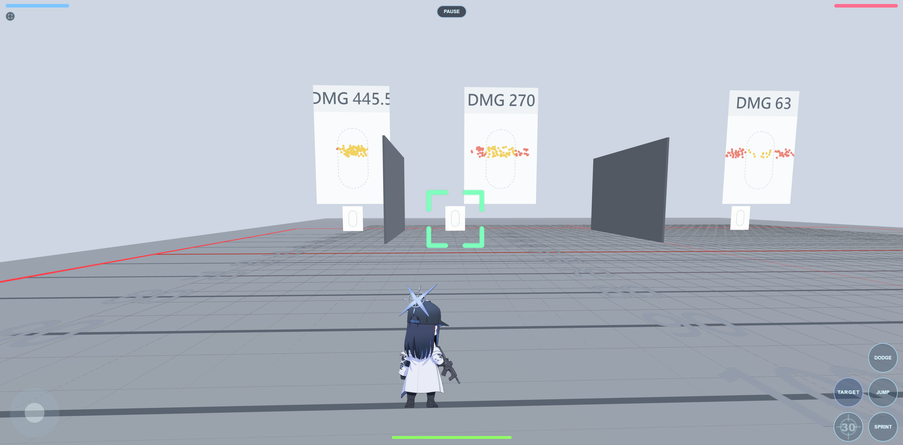
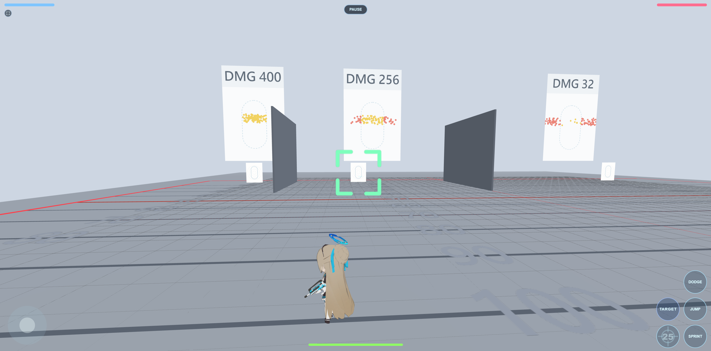
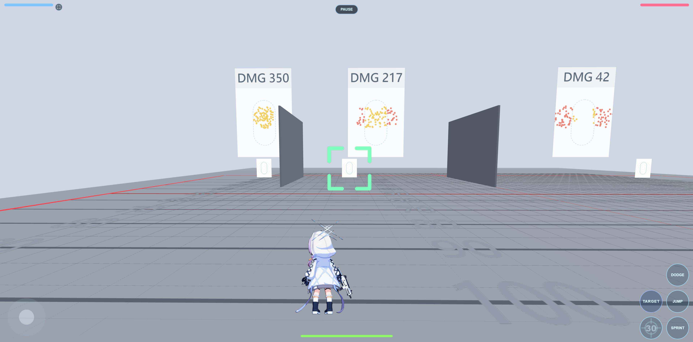
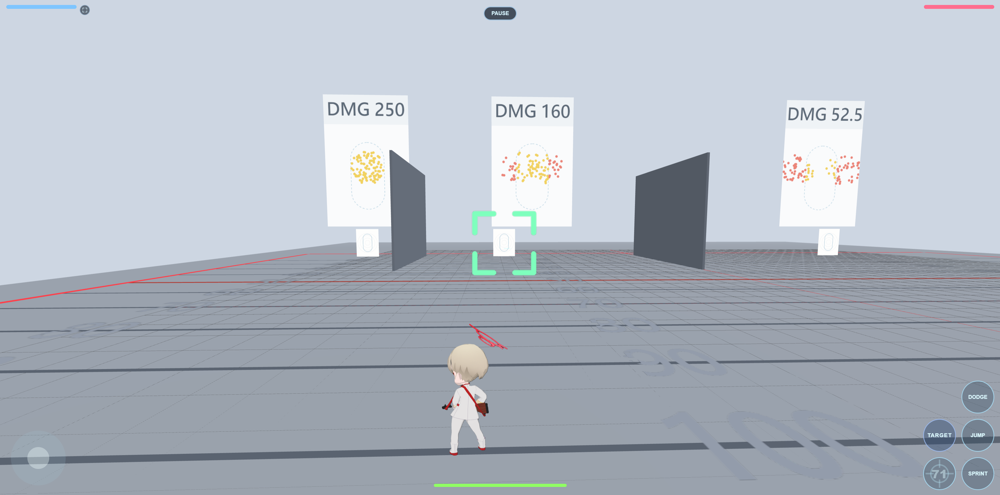
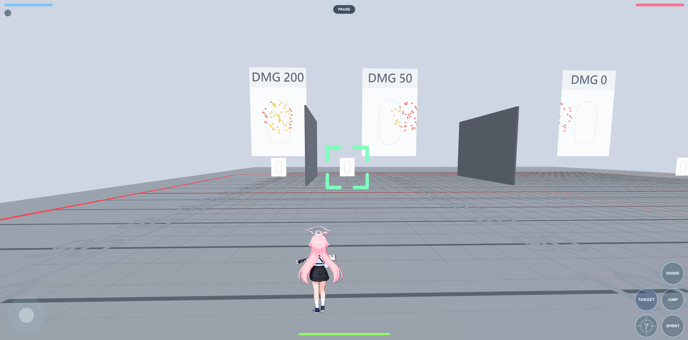
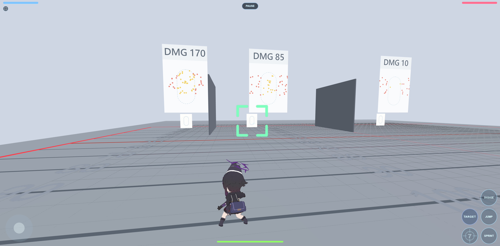
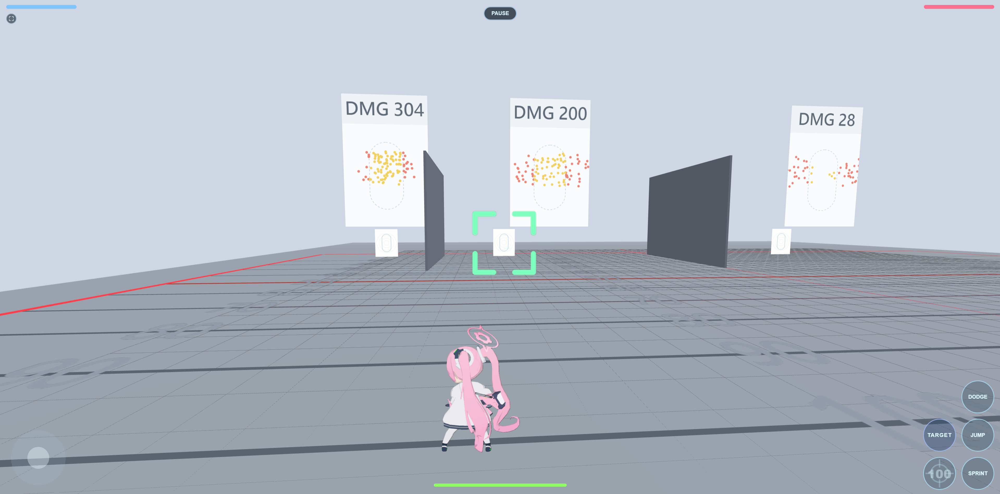
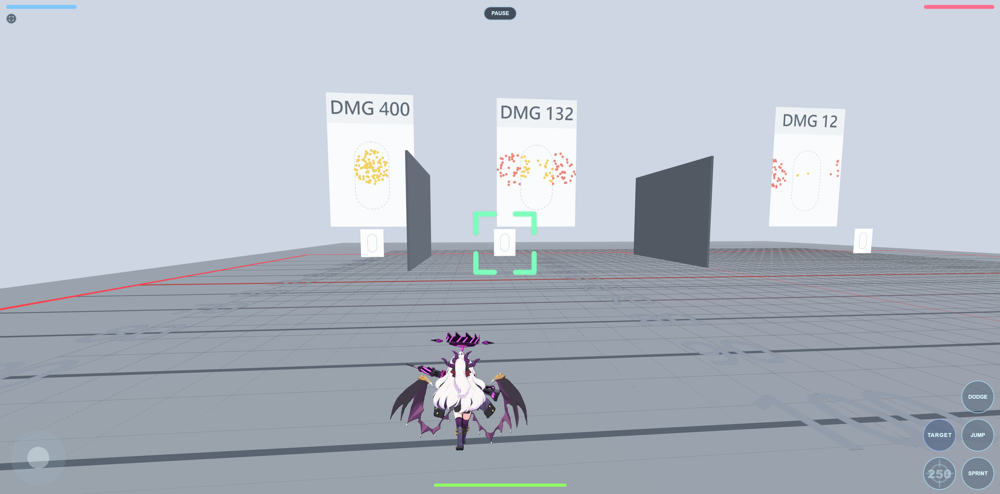

# Gun VS Gun

A fast-paced 1v1 / 2v2 arena prototype with two main modes — **Duel** (single stock) and **Trio** (three-unit rosters). Auto-aim — no manual targeting. The fight is about resource management: when to sprint, when to dodge, when to break line of sight, when to fire.

## Modes

Two main modes, each playable **1v1 or 2v2**, offline and online:

- **Duel** — classic single stock: one unit per fighter; a team loses when all its fighters are down.
- **Trio** — three-unit stock: every slot (human or bot) fields an **ordered roster of three units**, repeats allowed. When a unit dies, the slot's next unit respawns at its original spawn point with the standard 3 s spawn immunity; the killer keeps position / HP / boost — no kill reward. A team loses when every roster on its side is spent. Each fighter's remaining units show as a row of small weapon renders under their side's HP bars (one line per team member; Duel shows its single unit the same way), and a small golden glow-bar marks each Trio line's currently fielded weapon.
- **Spectating (2v2, both modes)**: if you're out for good while your ally fights on, the camera follows the ally with your own-unit visual kit (rear art + through-wall X-ray); the lock reticle stays up and mirrors the ally's actual target (the TARGET button goes inert).

Orthogonal to all of the above, every player also picks a **view mode** — **Classic** (the chase camera you pilot directly) or **Command** (a commander's diorama view where your unit fights on its own bot brain and you give it orders). See the **Command mode** section below.

### Offline
- **1v1**: you vs one enemy bot.
- **2v2**: you + an ally bot vs two enemy bots. Friendly fire is off between teammates.
- **Trio picks**: you select your three units in order, then each bot's three — same selection grid, titles count up (1/3 → 3/3).
- Optional "Dummy" mode on the map-select screen — zeroes out damage from every bot (enemies and your ally), so you can practice movement and observe bot behaviour without dying.
- Optional "Spectator" mode beside it — a bot takes over your unit and you watch the match: **TARGET** cycles the camera across every unit on the field (both teams), the HUD (HP / boost / ammo) follows whoever you're watching, the edge arrows stay viewer-relative, and the end banner reads **TEAM 1 WINS / TEAM 2 WINS**. Stacks with Dummy for an endless no-deaths bot exhibition.
- The main menu also carries a **Guide** button (a popup summarising controls, mechanics and the command-mode gestures) and a **Server Boot-up** button that opens the online debug panel.

### Online
- **Mode selection**: the host picks **Duel or Trio**, then **1v1 or 2v2**; joiners inherit the lobby's modes.
- **1v1**: the host presses **Start Match** when ready. The opponent slot holds a bot (default **Saori / Unit 1**) until a second human queues in and takes it — start early to play the bot, or wait for a player.
- **2v2**: the host presses **Start Match** when ready; empty player slots fill with bots (2v2 rooms open as Saori / Hoshino / Aru / Atsuko by slot; Trio bots field three copies of that unit unless the host picks otherwise). Up to four humans can play (any split between teams); bots fill any remaining slots.
- **Bot unit selection**: in the lobby, the host can tap any bot slot to pick which unit that bot plays — in Trio, its three units in order (default: three copies of the slot's usual unit). A human joining the slot always overrides the bot.
- **Trio queue room**: every slot's roster is shown in three lines and updates live as picks land.
- **View mode**: each player picks Classic or Command in the queue room; the pick is final once the match starts and is never shown to the other team (teammates see it as a gold **[CMD]** tag on the roster line). Details in the Command mode section.
- **Slot-colored corner HUD** (online, 2026-08-22): the corner HP bars follow the **server slot** — left column team A (p1 top / p3 bottom), right column team B (p2 top / p4 bottom), each bar tinted its slot color (p1 blue / p2 pink / p3 green / p4 orange), the same picture for every viewer and spectator (1v1: p1 left, p2 right); your own bar wears a thin **white rim**. The command diorama's markers, cards, rings and lock triangles use the same slot colors online (offline keeps the role palette).
- **Host migration**: if the host leaves in the lobby or at the end menu, the longest-waiting player is promoted to host (their unit picks carry over; the lobby keeps its Duel / Trio and 1v1 / 2v2 settings and the new host re-chooses the map).
- Multi-lobby — when an existing lobby is full or running, new joiners spawn their own lobby and become host.
- Team swap in 2v2: any non-host player can `Join` an empty slot to switch teams (e.g. two humans want to co-op on one side against two bots).

### Unit profile card

The first tap on a unit card opens its profile beside the grid (tap the same card again to confirm, anywhere else to cancel): the character art on the left and the **weapon panel** on the right — the gun's real-world name, its render, and since 2026-09-22 a **3×2 stat grid** under the render (owner pick "C" from three in-game samples: a third plate beside the panel and a label/value row list were the other two; the demo line carries the same stats as a row list). The six cells read live from the unit data:

- **Mag**, **RPM** and **Reload** (seconds) as plain numbers.
- **Dmg** shows every tier where a gun has them: Aru's PSG1 `50/35/20` (far / mid / near), Kei's Laser `30/20` (quick / charged), the shotguns per pellet `3 ×8`.
- **Movement** is the walk-speed tier word (walk speeds retuned 2026-09-24): **Fast** (walk 16 — Atsuko, Marina, Hoshino, Haruka), **Medium** (12 — Saori, Asuna, Fubuki, Aris, Aru, Kei), **Slow** (Koyuki at 10, Hina at 8).
- The **Spread picture** is a seeded mini-simulation of a **walking spray at a common 60-unit reference** (the shotguns at their own 40): the ring is a standing target's half-width at that distance, the orange dots are up to 30 rounds — magazine-limited — each leaving on the cone the sim gives that round (base + bloom, per-round bloom up to the cap, and the between-round recovery of the no-delay marksman rifles), fading with round order so the first rounds read brightest. The spray stops at the first round whose cone no longer fits the frame (2026-09-22, owner pick from samples — pinning spilled rounds to the frame's edge had piled Fubuki's 27 out-of-frame rounds into a rectangle), so nothing is drawn outside the frame: Saori's whole 30-round spray stays inside the ring, Koyuki's and Hina's pictures end a few rounds short of the magazine with their late rounds at the frame's edge, and Fubuki's and Aris's show their first three quick rounds — one on the ring's centre, two at its edge — because the fourth already flies wider than the frame; the shotguns show their 8-pellet pattern (SDASS with its 1.4× horizontal stretch).

The grid keeps the same sizes on phones (checked at 390 px: nothing wraps or spills).

### Random & All Random cards

Both offline and online pickers carry them:

- Every unit grid has a gray **Random** card (question-mark thumbnail): it rolls a unit the roster being built doesn't already contain (different players can still land on the same unit). The map grid's Random skips **Shooting Range** and **Plain Field**.
- Every unit grid also carries a golden **All Random** card: one confirm fills every remaining unit slot of the current flow at once and advances it (offline: the rest of your roster, then every bot picker that follows — Duel included; online: the rest of your roster). The map picker deliberately has no All Random.

## Command mode

The alternative to the classic chase camera (2026-08-21): a tilt-shift **diorama overview** of the whole map where the units fight on the standard bot brain and you play the commander — observe, select, order. The picker is a Classic / Command chip in the menus; like Duel / 1v1 the choice is session-only — every site open starts Classic. Offline, `V` or the pause menu also toggles it mid-match, and solo 2v2 play commands **both** of team one's units; online the pick happens in the queue room, is final once the match starts, and commands your own unit **plus a bot-filled teammate slot** (2026-08-22 — human teammates are never commandable; details in Command mode online below).

**Orders** — two kinds, layered on top of the bot rather than replacing it:

- **Move order** — tap your unit (selection glow), then tap anywhere on the map; or drag from the unit and release. Where floors stack (a bridge deck over ground), **hold** the tap to cycle the vertical layer — the stack lists only standable floors, and the preview auto-picks the lowest reachable one. The unit pathfinds to the spot, **fighting along the way but never abandoning the destination** — travel is **pathfinder-guided the whole way** (2026-08-22): the route re-plans from the unit's current position after every combat reflex and on a 1.5 s cadence, and the unit **vaults the route's jump-links** (raised platforms, fence gaps) instead of grinding at the ledge. On arrival it holds the area in an Engage-style orbit anchored on a **radius-12 ring** for **20 s**, then returns to full autonomy; the orbit **turns around at walls** (a ring straddling a fence — Airport's rim glass, say — patrols the reachable arc instead of grinding the pane), and a unit knocked out of the area by a Defense escape **returns as a fresh pathfinder-guided travel leg**, resuming whatever remains of the 20 s window. An unreachable spot draws a red **"Area is not available"** note at the tap and keeps your selection for an immediate retry. The standing ring is also a live handle (2026-08-27, nothing selected): **grab it anywhere on its disc and drag** to move the order (the whole circle plus a finger-sized margin counts at any zoom — a tap inside the area still orders a *selected* unit there, since ring grabs only engage with nothing selected) — the ring brightens in its unit's color the moment you pick it up (overlapping rings resolve to the nearer center; a dead tie hands it to your own unit), the same preview / validation / layer rules apply, and releasing re-issues the order with a **fresh 20 s window** (any drag counts, even released back where it started — there is no in-place cancel; an unreachable release just draws the red note and leaves the old order untouched) — or **double-tap the ring** to withdraw the move order alone (a standing force lock survives).
- **Force lock** — with your unit selected, tap an enemy: the unit locks that target until **either party dies**, then falls back to its own target-finding. The pinned enemy wears corner **triangles in the commanding unit's color** (the X layout; when two allied commanders pin the same enemy, the later lock wears the **+** edge-midpoint layout instead of splitting corners). Tapping the same enemy again cancels the lock; with **nothing selected**, tapping the pinned enemy's marker or card releases **every lock your units hold on it** at once (2026-08-27 — covers the bot teammate without selecting it; a human teammate's lock is never yours to drop).
- One command per selection — the glow drops as soon as an order lands. **Double-tap** your unit to clear both orders at once; a slow re-tap just deselects.
- **Reflexes always preempt orders**: Defense escapes, the anti-sniper dodge, cover reload, hit-stun and the rest interrupt exactly as in autonomous play, and the route replans from wherever the unit ends up.

**Commanded travel dashes on the normal stamina economy** — no speed cheat. Dash segments are *latched*: a segment only starts once boost reaches **125** (or the unit's cap if lower), spends down to a **50-boost reserve floor**, then the unit walks until the gauge re-arms. Route jumps fund at the flat **mandated tier — 60 boost** (2026-08-22, shared with the Defense survival hop; the bot's discretionary jumps keep their 250 reserve gate, which the 50↔125 dash cycle could never reach), and while a jump lies ahead on the route the dash floor rises to **70** so the unit always arrives at the ledge able to afford the hop. Cap, drain and regen are the human values throughout; combat reflexes keep their own funding rules (Defense may still spend through the floor to survive).

**Status icons** — gold, on both the unit's marker and its info card: **`!`** while a move order stands (en route plus the 20 s anchor), an **eye** while force-locking (pairing with the colored triangles on the enemy); both side by side when both are active, no icon when the unit is autonomous.

**Camera & HUD** — free camera: drag empty ground to pan, pinch / wheel to zoom, `Q`/`E` / right-mouse drag / two-finger twist to rotate about the screen centre; the tilt-shift blur keeps the miniature look with a clear pocket around every unit. Info cards dock in fixed corners — your team bottom-left, enemies bottom-right — each carrying HP and a **stamina bar** (the enemy's stamina bar is hidden online). The joystick, action buttons and the bottom-center stamina bar are gone: fire / dodge / jump / sprint are bot decisions, and each unit's stamina lives on its info card. On Factory, Lobby, Station, Airport and Flashpoint the tall airborne dressing (pipes, trusses, signage, ceiling grids) hides while command mode stands and returns in classic — visual only, nothing collidable.

### Command mode online

- **Queue-room pick, hidden from opponents.** The Classic / Command chip sits above the roster in the waiting room; the pick locks when the match starts (no mid-match toggle online) and is never sent to the other team — only teammates see it, as the gold **[CMD]** roster tag. Behavior will still hint it; accepted.
- **Your unit — and your bot teammate (2026-08-22).** A commander drives their own unit and, when the teammate slot was **bot-filled at match start**, that bot too (same tap/drag orders; the bot's lock triangles wear its own slot color; each unit has its own 0.5 s order rate limit). Human teammates are never commandable, and the commandable set freezes at match start — a mid-match disconnect turns that human's unit into a plain bot, but it is not adopted.
- **Server-authoritative orders.** The commander's client sends dedicated order messages; the server re-validates each one against the same pathfind checks (with a 500 ms rate limit per ordered unit — your own unit and the bot teammate throttle separately, and clears are never rate-limited) and answers with an ack the selection glow waits for. Commander clients skip movement prediction entirely — the unit is server-driven like any bot, and command timers run on the server clock.
- **Teammate share (2v2).** A command teammate sees your full annotations (destination ring, icons, lock triangles) in their own diorama. A **classic** teammate gets an in-world render: a ground ring in the commander's slot color standing at your unit's ordered destination, plus your lock triangles framing just outside their own crosshair when they face the pinned enemy. Both indicators die with the commander's unit.
- **Information hiding.** Snapshots are filtered per team: the enemy's boost value, standing orders and bot-intent state never reach your client. Boost-inference tells (overheat, sprint-lock, thruster effects) deliberately stay visible. Spectators watch in classic view with no command overlays.
- **Disconnects.** 1v1 keeps the instant forfeit; in 2v2 a disconnected commander's orders clear and the unit fights on as a plain bot.

## Units

Twelve pickable units, near-identical base stats (100 HP, 250 boost, 11.76 sprint base; walk speeds since 2026-09-24: 16 for the SMGs and shotguns, 12 for the assault rifles, rifles and snipers, 10 for Unit 12, 8 for Unit 5; Unit 7 flies):

**Weapons:**

| | Mag | Damage | Fire rate | Projectile speed | Lock range (1v1 / 2v2) | Reload |
|---|---|---|---|---|---|---|
| Unit 1 — Assault Rifle (Saori) | 30 | 4 / shot | ~700 RPM | 600 | 56 / 60 | 1.5 s |
| Unit 9 — Assault Rifle (Asuna) | 25 | 4 / shot | ~900 RPM | 600 | 56 / 60 | 1.5 s |
| Unit 4 — Submachine Gun (Atsuko) | 30 | 3.5 / shot | ~1100 RPM | 600 | 50 / 55 | 1.5 s |
| Unit 13 — Submachine Gun (Marina) | 71 | 2.5 / shot | ~1250 RPM | 600 | 50 / 55 | 2 s |
| Unit 2 — Shotgun (Hoshino) | 7 | 3 × 8 pellets | ~250 RPM | 350 | 40 / 50 | 1.2 s (auto, per round) |
| Unit 11 — Shotgun (Haruka) | 7 | 3 × 8 pellets | ~250 RPM | 350 | 40 / 50 | 1.2 s (auto, per round) |
| Unit 12 — Machine Gun (Koyuki) | 100 | 4.5 / shot | ~600 RPM | 600 | 80 / 65 | 5 s |
| Unit 5 — Machine Gun (Hina) | 250 | 4 / shot | ~1250 RPM | 600 | 80 / 65 | 7 s |
| Unit 10 — Rifle (Fubuki) | 30 | 13 / shot | ~180 RPM | 600 | 56 / 65 | 2 s |
| Unit 7 — Rifle (Aris) | 8 | 12 / bolt | ~180 RPM | 600 | 56 / 65 | 1.2 s (auto, per round) |
| Unit 3 — Sniper Rifle (Aru) | 5 | 50 / 35 / 20 by range | 60 RPM | 2500 | 120 / 70 | 2.5 s + 1 s charge |
| Unit 6 — Laser Sniper (Kei) | 5 | 30 / beam (charged sweep: 20) | 60 RPM | instant (hitscan) | 120 / 70 | 2.5 s + 1 s charge |

**Theoretical DPS** (every shot landing; cadences are the real 16 ms tick slots, not label RPM):

| Unit | Real cadence | Dmg/shot | Burst DPS | Sustained (incl. reload) |
|---|---|---|---|---|
| Hoshino / Haruka | 4.17 blasts/s | 24 (8×3, point-blank) | **100.0** | ~20.0 (shell-regen limited) |
| Hina | 20.8/s (48 ms) | 4 | **83.3** | 52.8 |
| Atsuko | 15.6/s (64 ms) | 3.5 | **54.7** | 31.3 |
| Marina | 20.8/s (48 ms) | 2.5 | **52.1** | 33.1 |
| Asuna | 12.5/s (80 ms) | 4 | **50.0** | 29.2 |
| Saori | 10.4/s (96 ms) | 4 | **41.7** | 28.0 |
| Koyuki | 8.9/s (112 ms) | 4.5 | **40.2** | 28.0 |
| Fubuki | 2.98/s (336 ms) | 13 | **38.7** | 33.2 |
| Aris | 2.98/s (336 ms) | 12 / bolt | **35.7** | ~10.0 (bolt-regen limited) |
| Aru | 1 per ~1.5 s (snap cycle) | 50 / 35 / 20 by range | **~33.3** (full-damage snaps) | ~33.3 |
| Kei | 1 per ~1.5 s | 30 quick beam | **~20.0** | ~20.0 |

Reading the DPS table: the shotgun row is the most theoretical — all 8 pellets only land point-blank, and the 7-shell magazine burns in ~1.7 s before per-shell regen throttles the long run. Aris's burst is real for his 8-bolt spike (96 damage in ~2.4 s), then collapses to the worst sustained figure in the game. The sniper rows use cycle math (cooldown + floor charge) at full range-tier damage. The tight 40–55 spread across five mid-table guns is deliberate — fights are decided by accuracy curves, uptime, and positioning rather than raw DPS. The two 180 RPM rifles (Aris, Fubuki) sit under that band on purpose: their 336 ms slot trades cadence for the heaviest per-shot chunks among the autos.

**Handling (stun + spread):**

| | Stun | Base SA | Bloom / shot | SA cap | Recovery | Sure-hit base → cap |
|---|---|---|---|---|---|---|
| Unit 1 — Saori | 100 ms @ 0.25 | 0.02 | +0.002 | 0.06 | 0.035/s, 200 ms after the last shot | 160 → 53 |
| Unit 9 — Asuna | 100 ms @ 0.25 | 0.02 | +0.003 | 0.06 | 0.035/s, 200 ms | 160 → 53 |
| Unit 4 — Atsuko | 50 ms @ 0.50 | 0.03 | +0.003 | 0.08 | 0.05/s, 200 ms | 107 → 40 |
| Unit 13 — Marina | 50 ms @ 0.50 | 0.06 | +0.003 | 0.11 | 0.05/s, 200 ms | 53 → 29 |
| Unit 2 — Hoshino | 100 ms @ 0.25 | pattern (see below) | — | — | — | pattern |
| Unit 11 — Haruka | 100 ms @ 0.25 | pattern, 1.4× wide (see below) | — | — | — | pattern |
| Unit 12 — Koyuki | 100 ms @ 0.25 | 0.02 | +0.004 | 0.12 | 0.03/s, 200 ms | 160 → 27 |
| Unit 5 — Hina | 50 ms @ 0.85 | 0.04 | +0.003 | 0.14 | 0.03/s, 200 ms | 80 → 23 |
| Unit 10 — Fubuki | 100 ms @ 0.25 | 0.02 | +0.10 | 0.30 | 0.17/s, no delay | 160 → 11 |
| Unit 7 — Aris | 100 ms @ 0.25 | 0.02 | +0.10 | 0.20 | 0.17/s, no delay | 160 → 16 |
| Unit 3 — Aru | 100 ms @ 0.25 | 0.02 | — | — | — | 160 |
| Unit 6 — Kei | 100 ms @ 0.25 | — (beam) | — | — | — | instant |

Unit 13 is the lightest bullet in the game on Hina's cadence: the 48 ms tick slot (20.8 shots/s) in an SMG chassis and a 71-round drum — ~3.4 s of continuous fire (≈178 damage per drum) behind a 2 s reload. Suppression-first: her value is steady chip on the longest trigger in the SMG class, plus the boost her stream forces targets to burn escaping; the kill usually needs cross-fire or a second drum. Since 0.5.9 the SMG spread profiles follow the real guns, and since the 2026-09-22 bloom port they do it through the base cone: the WWII PPSh hoses wide (Marina keeps her 0.06 base and blooms to 0.11), the modern EVO3 shoots tight (Atsuko's base came down to 0.03, blooming to 0.08).

**Reading the stun column** (`duration @ move-scale`): every landed hit slows the victim's movement to *move-scale* for *duration* — e.g. `100 ms @ 0.25` means crawling at 25% speed for 100 ms. Each new hit refreshes it; when two stuns compete, the heavier slow (lower scale) wins. **In practice the slow itself is a minor stat**: sprinting pays straight through it (and everyone sprints away from fire anyway, stun or not), while a walking target was already highly hittable — so the currencies that actually decide fights are the damage actually landed and the boost the target burns escaping, not the movement penalty.

**Reading the spread columns (2026-09-22, spread bloom — ported from the demo line, owner questionnaire):** every cone angle is in radians and describes the FULL cone — a shot deviates from the aim line by at most half of it. Horizontal spread (HA) is gone from every unit. Instead each shot **blooms** the cone: firing adds *Bloom / shot* to the gun's spread, up to *SA cap*, and once the *Recovery* delay has passed since the last shot the extra spread drains back at the listed rate (the two 180 RPM rifles recover between the shots of a burst too — *no delay* — which is what shapes them: Fubuki's or Aris's second quick shot leaves at 0.063 rather than 0.02). Since angular error grows with distance, a cone has a **sure-hit distance** against a standing target — 3.2 ÷ spread, 3.2 being the hit capsule's width — inside which every shot lands; beyond it, hit chance falls off roughly as sure-hit ÷ distance. The table gives it at the base cone and at the cap: a fresh trigger pull is pin-point, a long spray is not, and tapping keeps a gun near its base numbers. **Standing still is the other way to stay pin-point**: a shooter that has stood on the ground at under 1 unit/s for 200 ms fires without adding bloom, and whatever bloom it carried drains at the gun's recovery rate even while it keeps firing — the price is being a stationary target. The shotguns ignore the cones entirely: their pellets fly a fixed 8-point pattern that opens toward ~5.8 wide over the first 70 units of flight — at lock range it is still a tight ~3.3-wide cluster; Haruka's pattern is additionally stretched 1.4× horizontally (details below).

**Preferred engage distance:** every unit's fighting range is its **lock range ± 7** — the band where bots hold position, orbit, and fire (in 1v1: shotgun 33–47, SMGs 43–57, snipers 113–127). One rule for all weapons: retune a lock range and the combat distance follows. **In 2v2 every bot switches to its 2v2 lock value** (the second number in the weapons table): the team's fighting bands compress into 50–70 so long-lock units stop hanging back — and letting a teammate die alone at the front — while short-lock units step up slightly. 1v1 keeps the classic values, and the change is bot-behavior only: the player-side lock reticle always reads the 1v1 number. Every pickable unit carries a 2v2 value; a unit without one would simply fall back to its 1v1 lock range.

**Measured hit rates** (Shooting Range; every unit fires from her own lock range; 100 shots per lane — shotguns 7 blasts = 56 pellets, rows show pellet rates):

| @ own lock range | Stationary | Walk (16 u/s) | Sprint (27.8 u/s) |
|---|---|---|---|
| Saori @56 | 99% | 69% | 6% |
| Asuna @56 | 100% | 64% | 8% |
| Atsuko @50 | 100% | 62% | 12% |
| Marina @50 | 85% | 61% | 18% |
| Hoshino @40 | 75% | 30% | 0% |
| Haruka @40 | 61% | 30% | 4% |
| Koyuki @80 | 76% | 40% | 3% |
| Hina @80 | 100% | 25% | 0% |

*Test environment:* Shooting Range (offline practice map). Each unit stands at her own lock range and empties the shot count into each lane in turn: a stationary sign, a walk-speed slider (16 u/s) and a sprint-speed slider (27.8 u/s) ping-ponging along their trails. **Shots are only taken while the target sign sits fully inside the giant score screen's width (both edges visible)** — i.e. only mid-trail, near-perpendicular engagements count. Near the trail edges a turning slider moves almost along the line of fire and is far easier to hit; earlier runs that fired across the whole trail inflated the mover columns and were retired. Screens accumulate per-lane damage and grouping — **yellow dots are hits** (plotted at the impact point), **red dots are misses** (plotted where the shot crosses the sign plane). Hit counts = screen damage ÷ per-hit damage.

Standouts under the strict protocol: perpendicular sprint is near-untouchable for everyone (the flight-time tax — only the wide-spread guns clip it at all), and the stationary column tracks each gun's sure-hit range faithfully. (These runs predate the 2026-09-22 bloom: read them as first-shot accuracy at the old base cones — HA included — not as spray accuracy.)

| | |
|---|---|
| **Saori @56** — 445.5 / 310.5 / 27  | **Asuna @56** — 400 / 256 / 32  |
| **Atsuko @50** — 350 / 217 / 42  | **Marina @50** — 212.5 / 152.5 / 45  |
| **Hoshino @40** — 210 / 85 / 0  | **Haruka @40** — 170 / 85 / 10  |
| **Koyuki @80** — 342 / 180 / 13.5  | **Hina @80** — 400 / 100 / 0  |

Projectiles fly straight (homing is zeroed universally). The targeting reticle is an **enemy-firing indicator**, not a range indicator: green by default, it flashes red while your current target is firing and stays red for the whole time a sniper is mid-charge with you as the target (see the sniper section). Being inside lock range is not signalled to players at all — the number only shapes bot behavior (bots hold their engage band around it). A faint in-lock tracer tint that once keyed to it was removed 2026-08-01.

### Units 2 & 11 — the shotgun blast

- A trigger pull fires **one flying pellet cluster** carrying a fixed 8-point pattern (randomly rotated each shot, so no two blasts look alike while the spacing geometry never clumps). Each pellet keeps its **own hitbox** and dies individually on walls or the target; damage = pellets landed × 5 (all 8 point-blank = 40, both shotguns).
- The pattern leaves the muzzle bunched and grows toward full width (~5.8 across) over the first **70 units** of flight. At lock range (40) it is ~57% open (~3.3 across), so locked-fire blasts land as a concentrated cluster rather than a full spread.
- **Haruka's wide fan (Unit 11):** her pattern is stretched **1.4× horizontally** after the per-shot rotation — the cloud is 1.4× wider and exactly as tall as Hoshino's (at lock 40: ~4.6 × 3.3; fully open: ~8.1 × 5.8). More graze coverage along the dodge axis, lighter pellets — the dodge-catcher to Hoshino's concentrated slug.
- One blast = one simulated/networked object instead of 8 — the wire-cost half of the old online "shotgun lag" fix; the projectile broadphase (see Implementation notes) removed the other half, the dense-map CPU cost.

### Aris (Unit 7) — flight & laser bolts

- **Flight kit**: a jump tap in the air re-fires the jump impulse (12 boost per pop, no cooldown); *holding* jump sustains a climb at sprint speed; air-sprint flies **level** (dedicated fly art); the air-dodge holds altitude. Boost does not regen while airborne — altitude is a spent resource.
- Sprinting into a jump **carries the sprint momentum** through the air.
- Her shot is a **64-unit-long laser bolt**: the thin cyan cylinder you see *is* the hitbox (both derive from one spec entry). It grows out of the muzzle — the body never reaches behind the spawn point — and hits with its whole length, so a dodge must clear the entire passing beam, not just its nose.

### Sniper charge & sprint-cancel

- Both snipers hold their shot on a **1 s charge** (locked in place). Holding sprint cancels the charge and fires early — but never before a **0.5 s floor** (costs ½ a dodge's boost). So the shooter picks any release point in the **0.5–1 s** window, and the target always gets at least that much glint-to-bullet warning.
- **Online floating unlock:** against a human defender the 0.5 s floor counts from the moment their client *actually rendered* the glint — the defender's client acks the glint's first frame and the server slides the earliest release to that ack + 0.5 s — the defender's half-second of SEEN warning is absolute. If the ack never arrives (defender's tab backgrounded, client stalled; the server waits up to 0.5 s), the earliest release becomes press + 1.0 s — exactly a normal full charge, so the attacker's worst case is simply losing the fast cancel for that shot. Offline play and bot defenders (who see server truth instantly) are unchanged.

**Sniper timing at a glance** (worked example: defender's network delay 0.05 s each way; projectile flight and 16 ms tick rounding excluded). Column definitions — *release time*: server clock, from processing the attacker's FIRE input to creating the projectile; *glint duration*: on each player's own display, from the frame the glint is first drawn to the frame the shot is drawn; *read & decide*: on the defender's side, from the glint's first drawn frame to the latest DODGE press that still reaches the server before the projectile exists.

| Release time | Glint duration (attacker's screen) | Glint duration (defender's screen) | Read & decide time |
|---|---|---|---|
| 0.60 (earliest the server permits) | 0.60 | 0.60 | **0.50** |
| 0.70 | 0.70 | 0.70 | 0.60 |
| 0.80 | 0.80 | 0.80 | 0.70 |
| 0.90 | 0.90 | 0.90 | 0.80 |
| 1.00 (server auto-fires) | 1.00 | 1.00 | **0.90** |

Three properties the table encodes: glint duration equals the release time on **every** screen (both endpoints of the interval shift by the same delivery delay, so its length is preserved for any observer); the defender's read & decide time is always the release time minus their round trip (one delivery lost at each end); and the earliest-release fence sits at ack + 0.5 s precisely so the read & decide column can never fall below 0.50 — the guarantee is produced by *placing the fence*, not by adjusting any clock. The full charge is the one release with no fence involvement: it fires at press + 1.0 s flat, so its read & decide time shrinks with the defender's round trip (lag-taxed like every ordinary attack), while the fast cancel's 0.50 is lag-proof.
- The **dodge** is the counter: a step grants **0.3 s** of i-frame immunity, so a well-timed dodge passes through the shot. Aru's bullet speed is **2500 u/s** (near-hitscan — only ~0.05 s flight even at max range); Kei's beam is instant.

### Aru (Unit 3) — range zones & the lock reticle

- Damage is tiered by distance, **locked at fire time**: under 15 units → **20**, 15–50 → **35**, beyond 50 → **50**. Rushing a sniper is real counterplay; long range stays lethal.
- The lock reticle shows the current zone — plain brackets (<15), **+ cross ticks** (15–50), **+ inner bars** (50+). It appears both when *you* play Aru (your tier on the target) and when your lock target *is* an Aru (which of her zones you're standing in).
- The reticle turns **red** not just when your target fires, but for the whole time a sniper (Aru **or** Kei) is **mid-charge with you as the target** — a continuous danger signal from glint to shot. Kei's live sweep channel also holds it red for the whole channel, whoever it is aimed at — the beam can hit anyone.

### Kei (Unit 6) — 照射ビーム laser

- Fires an instant **hitscan beam** (30 damage, one hit per enemy per beam, blocked by walls, ~0.5 s fade) instead of a bullet. The beam also **deletes projectiles** it touches. The hit volume stops one combined body-width (beam radius + target radius) short of the wall it ends on (2026-09-10), so neither the quick beam nor the sweep channel registers on a unit standing just behind cover — before, the end cap reached up to ~3.2 u (channel ~4 u) through the wall.
- Holding the charge to the full **1 s** fires a **sweep channel**: a 1 s locked, steerable beam (1.5× width, **20 damage**, one hit per enemy for the whole channel). The stick steers it — horizontal and vertical — at ~10°/s; sprint cancels the channel. The fire cooldown is paused during the channel and starts when it ends.
- Her glint grows toward **2×** size as the charge fills, telegraphing a full-charge sweep.

**Bots vs. the sniper.**
- **As the shooter:** both sniper bots flip a **50/50 coin** per shot — release at the **0.5 s floor** (a fast snap; for Kei, the quick beam) or hold to the **full 1 s charge** (for Kei, the sweep channel). No in-between releases.
- **On defense:** when a glint aimed at it appears — from **any** enemy, locked or not (mirroring the human's edge-indicator awareness; earliest active charge wins) — the bot **rolls its reaction per charge**, and the slow roll is charger-aware:
  - **Anti-Aru** (bullet snipers): **50% at 0.4 s** (i-frames open ahead of the earliest possible cancel, covering **every floor snap at any range** — but a full hold sails in after they end) / **50% at 0.8 s** (deliberately late: a snap lands first and cancels the pending dodge, but the i-frames ~0.8–1.1 s sit exactly on the **full hold's** impact). Against the shooter's 50/50 snap/hold flip neither side can be read; equilibrium **~50% of charges convert** (snaps beat slow rolls, holds beat fast rolls).
  - **Anti-Kei** (beam snipers): **50% at 0.4 s** (covers the instant quick beam) / **50% at 0.9 s** — the dodge starts just ahead of the **sweep channel's** aimed opening (i-frames ~0.9–1.2 s blanket it) and the follow-up sprint outruns the beam's steering at normal fighting ranges. (An 0.8 s roll would be dead weight here: the quick beam pre-empts it and the sweep outlives it.)

  Either way it's one dodge (0.3 s i-frames) plus a **0.52 s** committed sprint, both perpendicular to that sniper's line of fire; lock and return fire stay on the current target throughout. Mid-charge hits still cancel a pending dodge, and a cooldown- or boost-blocked defender still eats the shot. After the committed sprint expires the bot has no awareness of a still-live sweep — it can wander back into the channel.

**Bot trigger discipline.** A bot fires in continuous bursts of a fixed per-unit length (`botFireCap` — the "fire cap"), resting ~0.8–1.5 s between bursts. This rhythm is the bottom layer; the **bloom gate** (Bot logic below, 2026-09-22) sits on top of it and only shapes the machine guns' and the marksman rifles' fire inside their bands. Shots inside a burst pace at the weapon's own RPM-derived cooldown, so retuning a fire rate retunes the bot with it. Every auto's cap equals its **full magazine** — an auto bot fires until the mag runs dry and rolls straight into the reload; the shotguns are burst-gated at 4 blasts per pull; the snipers run their charge cycle instead of bursting.

| Unit | Fire cap | Meaning |
|---|---|---|
| Saori | 30 | full mag |
| Asuna | 25 | full mag |
| Atsuko | 30 | full mag |
| Marina | 71 | full drum |
| Fubuki | 30 | full mag |
| Koyuki | 100 | full mag |
| Hina | 250 | full drum (~12 s of continuous fire) |
| Hoshino / Haruka | 4 | 4 blasts per trigger pull |
| Aris | 4 | legacy formula (half mag) |
| Aru / Kei | — | charge cycle, no bursts |

A burst ends early if the mag runs dry (straight into the reload), if line of sight breaks (re-checked every 0.22 s; the burst then restarts from full), or if the target is **spawn-immune** — bots hold fire at immune targets and wake the moment immunity lapses. A bot's OWN spawn immunity does **not** hold its fire: a freshly spawned bot shoots from behind its protection window, same as a player would.

### Fubuki (Unit 10) & Aru (Unit 3) — ribbon tracers

Fubuki's Ruger rounds draw a **camera-facing ribbon trail** (2026-09-19, the demo line's marksman-rifle treatment): a real quad of world half-width 0.06 that re-aims at the camera every frame — live and while fading — so it reads as a thicker, smoke-like streak that thins with range like a physical object. Aru's PSG1 rounds carry the same ribbon at the demo line's deliberately fatter sniper width, half-width 0.10, fading over the sniper's 1 s (2026-09-22, owner: "use the 0.8.3 trails" — with that the BA line's trails match the demo line gun for gun: the six autos on the 1-pixel line, the rifle on the 0.06 ribbon, the sniper on the 0.10 ribbon). **Both ribbons glow** (2026-09-23, owner pick "C" from four in-game samples): the core at the gun's own width sits over a second quad 3.2× wider and much fainter as a soft edge; the fade scales both quads. The samples were additive amber; the owner then asked for the autos' per-map ink (2026-09-23) and, because additive light can never match an alpha-blended line (it read white on the dark maps and as a pale highlight on the bright ones, where the autos' line is a dark stroke), finally for the same **visual** colour (2026-09-24): both quads now blend normally in the autos' ink — light grey `0xbbbbbb` on the dark maps, dark slate `0x3a3f4a` on Lobby, Airport and the Shooting Range — with the core's alpha set so that core over halo composites to exactly the line's 0.55. The streak reads as the same grey as the autos' line, wider and soft-edged. The cost is one extra quad (one draw call) per ribbon trail and the same per-frame re-aim the ribbon already did — no post-processing, nothing on the network. It runs on every map: the three bright-ground maps (Lobby, Airport, Shooting Range) were first left on the plain slate ribbon because additive light cannot darken, but the owner chose the same additive glow there too (2026-09-23, seen beside four normal-blend alternatives). Every other gun keeps the 1-pixel line trail everywhere (MG / rifle rounds fade in 100 ms; shotgun pellets have none, Aris's bolt is its own trail and Kei's beam is hitscan). Visual only — hit detection is untouched.

## Bot logic

One bot brain drives every bot — all maps, all modes, offline and online (the offline client and the server run mirrored copies of the same rules; every bot slot in 1v1 / 2v2 / Trio / spectator uses the identical body).

**State machine** — `Defense > Maze > Engage > Pursue`, re-evaluated every tick:

- **Pursue** — closes to (or backs off to) the fighting band, **lock range ± 7**. Sprint spends down to the strategic reserve (250 — a full dodge plus margin always stays banked). Elevation aids: jump up toward a higher target when close, hop off ledges toward a lower one, and on low ground hop onto any mountable ledge it brushes within jump reach.
- **Engage** — the in-band fight: orbits the target with a range correction toward the sweet spot, flips orbit direction to stay inside sight, and runs the peek-cover rhythm (tuck behind cover while the weapon cycles, drift out exactly when it's ready to fire). Two consecutive ticks of driving into a wall also flip the orbit — the tangent is perpendicular to the aim line, so reversing it always points away from the face just hit, and the bot unsticks itself inside the fight instead of breaking off to re-route. Opportunistically hops onto reachable ledges — high ground is the better vantage.
- **Defense** — triggered by a fresh hit: a committed straight cover-sprint (may spend boost to the hard floor — survival overrides the reserve), then a tuck-and-peek once cover breaks line of sight. A jumpable ledge lying **dead ahead** on the committed escape line (within ~37°) is hopped without breaking stride — never while a sniper dodge is scheduled (airborne can't dodge), and funded at the flat **mandated-jump tier (60 boost**, 2026-08-22 — shared with command-mode route jumps; discretionary travel jumps keep the 250 reserve gate**)**. If the escape wedges anyway, a wider-angle vault, then a direction flip.
- **Maze** — the router. Asks the nav grid for a real walk route (waypoint-followed, cut at the first spot that can already fire) and retries it on every stall signal; when no route exists it keeps moving on a minimal steer biased away from the last spot it got pinned at (a short back-out frees a truly wedged body first). Entered **proactively**: the moment the straight walk toward an out-of-band target is blocked (instantly when sightless; after 0.25 s when the target is visible over a low obstacle), plus the classic stuck detectors (a 1 s wedged/spinning window, a 1.5 s no-progress clock) and a 2 s no-line-of-sight clock. "Wedged" is judged on **net** movement — under 1.7 units in a second is stuck no matter how much wall the bot rubbed getting nowhere, which is what catches a slow slide along a face rather than only a dead stop.

**Steering** — each tick, a moving bot's direction is the sum of two pulls: "toward where it's going" plus "away from any wall it's about to touch"; the second pull is what makes bots slide around obstacles instead of walking into them. Invisible unit-only fences (the kind bullets fly through) get sorted by height: a fence low enough to jump (Station's / Flashpoint's 4-high platform edges) gives **no push at all**, so the bot can walk right up to it and the hop is fired by the jump reflexes above; a fence too tall to jump (Square's 14-high fountain colonnade, the tall panes flanking Streets' bridge slopes) pushes like any solid wall. And a fence the bot is already standing **above** pushes nothing — it passes over freely.

**What counts as a ledge** (all three perch behaviors share one test): the top has to sit **1.7–4.8** above the bot's floor — lower is walked onto, higher needs a ramp — the lip must be unfenced, and the surface must be at least **6 wide**. A jump carries 12–17 units horizontally, so anything thinner gets sailed clean over instead of mounted. Game-wide the width floor excludes exactly four surfaces — Factory's 4-wide conveyors and Scrapyard's 4-wide shack-row roofs; every other climbable surface is 10 or more across.

**Sight** — a bot "sees" its target only along lines a bullet could actually fly: the sight ray is blocked by every solid obstacle, and by walkable **ramps and elevated decks** too — a ramp is solid fill, so nothing sees through the wedge; a bridge deck on open pillars blocks only rays that cross the deck plane, so two units both *under* the bridge still see each other.

**Seeing vs shooting** — those are two separate questions, asked from two different heights. *Sight* is the eye line, and it drives awareness: target choice, routing, cover, when to break off. *Firing* is gated on the **muzzle** line instead — the exact line the bullet will take, tested with the bullet's own rules. The two are not interchangeable: a bullet leaves the chest, not the eye, so anything sitting in the gap between them (a slope's guard rail, a deck's underside, the slope surface itself) used to let a bot hold a picture-perfect sight line into a shot that died on the geometry. The gate now *is* the shot test, so a bot that pulls the trigger always has a path — and it will also take a shot through an invisible unit-only fence, because bullets genuinely pass through those. Sight treats such a fence as opaque only where it is flagged `blocksBotSight` (Streets' under-slope bars and slope gates — see-through walls the bot must route around); every other unit-only fence is as transparent to sight as it is to bullets.

**Sniper play** — covered in the sniper section above: 50/50 snap-or-hold as the shooter; as the defender, a per-charge dodge roll timed against the charger's kit, one committed perpendicular dodge + sprint.

**Bloom gate and suppressing fire** (ported from the demo line 2026-09-22) — a bot fires freely only while its target sits inside the gun's *current* **gate line**, re-checked every tick from the live distance: one closed-form division, run before the obstacle scan so an out-of-range poll costs nothing. The line is a fixed width divided by the bloomed cone: for the **auto weapons it is 8.84 ÷ cone — the distance where the cone still lands one round in three on a standing target** (the 3.2 × 6.4 capsule is a third of the cone's disc at radius 4.42; 2.76× the sure-hit line); for the **marksman rifles (Fubuki, Aris) it is the sure-hit line itself, 3.2 ÷ cone** (`botGateWidth: 3.2`); **the machine guns (Koyuki, Hina) have no line at all** (`botGateWidth: 0`, owner 2026-09-25 — a 0% threshold in both modes: they spray on the burst / rest rhythm alone, and for them a burst is the whole magazine — `botFireCap` equals the mag for every auto — so the reload is the rest). At their caps the other autos' lines sit at 147 (Saori, Asuna), 110 (Atsuko) and 80 (Marina), so inside the rifles' and SMGs' 43–63 bands the gate never trips and what you see there is the plain **burst / rest rhythm** of the trigger discipline above. When a line does close on a target (an auto pushed out past its capped line), the bot **holds until the cone has fully recovered** (200 ms + the bloom ÷ recovery) — the line drifting back out past a standing target does not release the hold, so there is no one-round trickle — and opens up again from the base cone. A target that **closes in** past where the line stood when the hold began releases it at once. Beyond the base cone's line (442 for the 0.02 guns, 295 for Atsuko, 221 for Hina, 147 for Marina) a recovered auto fires a committed **suppress burst** (five rounds for the rifles and machine guns, ten for the SMGs) and repeats. The **marksman rifles** live on the gate: each shot adds 0.10 of bloom and 0.17/s takes 0.59 s to shed it, so at their band they settle at one shot per ~0.6 s; their suppress burst is a single round (`botSuppressBurst: 1`). Shotguns (fixed pattern) and the snipers (their cone out-reaches lock range) are never gated. Offline and online run the same rule (shared `bloom.js`, `botMayFire` / `botGateDistance`). The demo line measured the gate line's effect over 6,336 bot duels (see that branch's README); this line has not been re-measured.

**Bot fire-gate thresholds** — the hit rate on a standing target below which the bot stops firing (the line is *width ÷ current cone*; 33% = width 8.84, 100% = the 3.2 sure-hit width, 0% = no line):

| Unit | 1v1 | 2v2 |
|---|---|---|
| Saori, Asuna, Atsuko, Marina | 33% | 33% |
| Koyuki, Hina | 0% (no gate) | 0% (no gate) |
| Fubuki, Aris | 100% | 100% |
| Hoshino, Haruka, Aru, Kei | never gated | never gated |

**Cover reload** — weapons with a manual reload of 3 s or more (Hina's 7 s drum, Koyuki's 5 s) don't stand in the open through it. When the mag runs dry the bot picks the nearest reachable spot that breaks its target's line of sight — scored to prefer cover it can still fight from — sprints there, and waits out the famine pacing a narrow arc behind the wall rather than standing frozen. It steps back out with 0.4 s left so the magazine fills as it re-enters the fight. Getting shot outranks all of it: Defense takes over and the plan resumes afterwards. Per-shell and auto reloaders (Hoshino, Haruka, Aris) are excluded by design — they're always mid-reload, so they'd never come out. The counterplay is to push: hiding beats a stationary opponent, not a committed one.

**Map-agnostic by design.** The bot rules that shipped carry no per-map special cases; a set of Station-only behaviors was built and field-tested, then parked behind a single master switch (`STATION_BOT_RULES`, off in both sims) once repositioning Station's spawns solved the same problem more cleanly.

## Controls

| | |
|---|---|
| **Mobile** | On-screen joystick + buttons |
| **PC** | `WASD` move · `J` fire · `K` sprint · `L` dodge · `Space` jump · `U` switch target (2v2; cycles lanes on the Shooting Range and the watched unit in Spectator mode) |
| **Command mode** | Tap unit → tap map = move order (hold to pick the floor) · drag from unit = move order · tap enemy = force lock · double-tap unit = clear · nothing selected: tap pinned enemy = drop your locks on it · drag ring = move the order (20 s restarts) · double-tap ring = drop move order · drag pan · pinch / wheel zoom · `Q`/`E` / right-drag / two-finger twist rotate · `V` toggle (offline) |

Double-tap `K` (or the sprint button) while holding a movement direction to lock sprint. The lock releases only after the stick/keys stay **neutral for a sustained 0.18 s** — flipping direction through the joystick center (left→right) or swapping movement keys keeps the locked sprint alive; letting go still stops it almost instantly. Dodge (step) grants 0.3 s of damage immunity (i-frames) — the full duration holds even when the dodge runs into a wall (the unit stops at the wall; the animation and i-frames don't cut short).

## HUD & unit displays

- **Overhead HP bar** above every unit (ported 2026-08-06): bright cyan `#7fe9ff` for the camera unit's team (2026-09-22, owner pick from in-game samples — settled on `#7fe9ff` after an hour on the paler `#a5f1ff`; the 2026-09-19 soft cyan read too dim, the near-white before it read as plain white), orange for its opponents — spectate-relative, so the watched unit's side always reads cyan. **Edged like the edge arrows** (2026-09-22, owner pick "E" from six in-game samples): a dark outline in the arrows' stroke colour `#0b1622`, ~2.9 px on the ~92 × 12 px on-screen bar (the arrow's stroke is ~2.7 px), rings the track pill, and the track is laid over a pill of the team ink so its empty part carries a faint cast of the team colour (its rounded corners keep a hairline of it) — the tint that set sample E apart from the plain-outline sample. The outline sits outside the pill, so the fill and track keep their old size; the old 2 px steel hairline is gone. **Portrait** (2026-09-26): the unit's picker thumbnail sits left of the bar in the same dark rounded frame (44 texture px, ~25 px on screen, the bar's outline width as its border), and the whole "portrait + bar" group stays centred over the unit's head with the bar at its old height — the portrait overhangs the bar evenly above and below, with a clear gap between its frame and the bar's outline. Constant on-screen size at any distance (compensated by true view depth) and visible through cover; teammates' bars ride the head at a fixed screen gap, the **locked** enemy's group sits just above the crosshair **as drawn right now** (2026-09-26, was a fixed 3 rs above the reticle's centre and read far too high): above the bracket square, or above Aru's mid / far tier marks when her reticle shows them, at the bracket's current bloom-grown size, and above the sniper-charge glint while one is showing — a screen-constant ~5–10 px gap, floored at the head anchor. Hidden while the command diorama runs (its info cards carry HP and stamina).
- **Team indicators (2v2)**: screen-edge arrows only — the friendly-bar cyan (the same `#7fe9ff`) pointing at the teammate, orange at the **unlocked enemy** — whenever that unit is off-frame; the floating chevrons that used to hover over both units in frame were removed on 2026-09-19 because they sat right on top of the overhead HP bars. Both edge arrows carry a glint halo while that unit is a sniper mid-charge.
- **Lock bracket bloom** (2026-09-22): the crosshair brackets around your target are drawn at half their former base size (owner call, matching the demo line) and grow with your *own* current spread bloom on **one universal scale** — ×1 with no bloom, growing at the same rate on every unit up to a ceiling of ×4.5, reached at 0.19 of bloom (the reference is 0.38, the demo SVD's full cap, with the growth run at twice that rate). Saori at her 0.06 cap shows about ×1.74, Marina ×1.92, Koyuki at 0.12 ×2.84, Aris ×4.32, Fubuki pins at ×4.5 from her 4th quick shot on. The commander's lock-share triangles and the command-mode markers keep their size.
- **Corner HUD**: HP bars per team member with the Trio weapon rows underneath (the fielded weapon marked in gold). Online the bars follow the server slot with a white rim on your own — see the Online section. In spectator mode the watched unit's corner bar wears a white glow rim.
- **Command mode** hides the joystick, the action buttons and the bottom-center stamina bar; the diorama's info cards show each unit's HP and stamina instead.

## Maps

Nine arenas: Plain Field, Streets, Factory, Scrapyard, Square, Lobby, Station, Flashpoint, Airport. Each has its own cover layout and elevation; Station has raised platforms players jump up onto, and Airport centers on a raised security plateau — glass-fenced rims, four ramp entrances, and a metal-detector checkpoint as the only way across the middle. On Streets, the storefront towers are solid to their full height (they block movement, fire, and bot sight) and their **rooftops are standable** — only flight gets up there, making them Aris's high ground. Streets' footbridge is **double width** and has two distinct spaces underneath, which behave differently: the lane under the **deck** is open ground — the deck stands on pillars, so you walk and shoot through it freely — while the wedge under each **slope** is solid. Nothing crosses a slope from below: no walking, no bot sight, no bullets. The four bridge approaches are screened by full-height **bastion hoardings** (8-tall panels on the deck at z ±16..±28 on both rail lines — true cover for the whole unit) that fade in step with the bridge itself. The offline map list also carries the **Shooting Range** — the no-opponent practice map behind the measured hit-rate tables above (target sliders, per-lane score screens); the map Random card never rolls it. On Streets the footbridge group (deck, slopes, rails, gates, pillars) fades whenever it hides **any living unit** from the camera — your ally included (2026-09-11), which is what keeps a teammate ordered under the deck visible in the command view.

**Spawns:** Station spawns sit in the platforms' far corners (±128, ±112 on the decks — the old track-corridor spawns anchored every fight to the railway axis), and Streets spawns sit at the diagonal corners (±126, ±82). Airport spawns sit on the ground at the mouth of a corner ramp (±130, ±56 — ramp feet at |z| 50), close enough that every bot climbs to the security plateau within seconds and the fight happens up top. 2v2 teammates offset along **X** on Station, Airport and Flashpoint so both members start side by side and equidistant from the objective; Streets and Factory offset along Z toward the map centre (a plain +Z would bury the teammate in the boundary wall). Keeping the pair equidistant is what matters: an offset that leaves one team nearer the objective hands that team the opening and pins the loser on the ground for the match. Lobby spawns sit against the side walls (±83, 38; teammates +12 along Z), each pair screened by its own **spawn counter** — a 9.4-tall check-in island 13u toward the centre that blocks every cross-map spawn sightline, so engagements start with an approach around either end instead of an instant stare-down.

**Scrapyard** (the scrapyard retheme of Factory 2 — internal key stays `factory2`) keeps the industrial remake's bones on Airport's design philosophy: one central organizing anchor — a raised **scrap-plank terrace** with four walk-up ramps plus jump-through fence openings (two 16-wide mid-side gaps and four corner notches) that bots use too, via the pathfinder's shortcut links — surrounded by dense, trustworthy cover (shanty huts, lived-in containers, upright cargo hulks, sheet-metal fences, market stalls) that passes the sizing rules everywhere: true cover is 8+ tall with real depth, vault clutter stays under 2.5. Two low walkable shack-row roofs (a jump up — no ramp) flank the terrace; the terrace itself is ramp-accessible from all four sides and nothing on the map is flight-only. The layout is point-symmetric, the retheme is visual-only (collision boxes are byte-identical to Factory 2, checksum-verified against the shared export), and its online collision data is exported from the offline builder with the `__exportArenaCollision('factory2')` console hook (re-run after any geometry change) so both modes stay identical.

## Project layout

- `client/` — Three.js + cannon-es + Vite frontend. Both offline match runtime and online client live here (`src/online/` holds the socket connection and the debug panel).
- `server/` — Node + Socket.IO authoritative game server. Multi-lobby, runs the shared simulation per match.
- `shared/` — pure-JS game logic that the server (and the online prediction layer in the client) consumes. State, physics, AI, projectile system.
- `render.yaml` — Render blueprint (free-tier deploy of both services).
- `PLAN.md` — implementation history / phased roadmap.
- `DIORAMA_PLAN.md` — design record for the diorama / command mode (offline phases and the online migration).
- `docs/img/` — the lock-range and weapon renders embedded above.
- `shared/test/` — the `node --test` suites CI runs.
- `.github/workflows/ci.yml` — `npm ci` + `npm test` on every push / PR.

## Local development

Install workspace dependencies from the repo root:

```
npm install
```

Run the server (terminal 1):

```
npm run dev:server
```

Run the client (terminal 2):

```
npm run dev:client
```

Run the shared-sim tests (what CI runs on every push / PR):

```
npm test
```

Open <http://localhost:5173>. The offline menu lets you pick a unit and play immediately. **Online (vs Player)** connects to the server you started in terminal 1.

## Deployment (Render)

The repo ships with `render.yaml` defining two free-tier services:

- `gvg-server` — Node web service (the Socket.IO server)
- `gvg-client` — static site (the Vite-built client)

After the first deploy, set the client's `VITE_SERVER_URL` environment variable in the Render dashboard to your server's public URL (e.g. `https://gvg-server-xxxx.onrender.com`) and redeploy the client. Both services are `autoDeploy: true`, the server exposes `/health` for Render's health check, and `render.yaml` bakes a placeholder `VITE_SERVER_URL` into the static build — the dashboard value overrides it.

> Free-tier services spin down after ~15 min idle. First connection to a cold server takes 30–60 s. Acceptable for prototype testing, not for production.

## Implementation notes

- **Server authoritative.** Shared sim runs on the server at ~62.5 Hz; clients predict their own local fighter and reconcile against snapshots.
- **Bot AI** has one logical state machine (Defense > Maze > Engage > Pursue) with identical numbers in both offline (`updateEnemy` in `client/src/main.js`) and online (`tickBot` in `shared/src/sim/ai.js`) implementations.
- **Universal pathfinder.** Maze is route-first: a nav grid is derived from each map's collision data (4-unit cells, A* plus a firing-position search), with jump-links bridging separated walk islands (e.g. Station's raised platforms) so bots climb instead of grinding walls. The old heuristic wall-following was retired once the grid covered every map; no-route ticks now run a minimal steer with a stuck-memory bias, re-planned on every stall signal. The grid is **multi-layer**: a cell can carry several stacked floors (the Streets bridge deck and the road beneath it are different nodes), so bots route under an overpass instead of treating the whole column as one surface. Cells are graded by how much room a body actually has, and A* pays extra to enter a tight one — a price, never a ban, so a genuinely narrow chokepoint costs more and still gets used. Planned routes are then **smoothed into diagonals** where it's provably safe: a run of grid legs collapses into one straight leg only when a swept corridor test passes. Doorways, ramps, jump-links and clutter alleys fail that test by design and keep their grid legs; open-field staircases become the diagonal you'd expect. Bots hold a per-weapon range band centered on their lock range (sweet spot ±7) — one rule for every weapon; in 2v2 the band derives from the compressed `lockRange2v2` value instead.
- **Bullets vs decks and ramps** (humans and bots alike). A walkable surface stops any round that **crosses** it — a shot fired under a bridge deck stays under it, and one fired into a slope dies on the slope. The test is exact: the segment is clipped to the surface's footprint and its height compared against the surface's at the two clipped ends, which is complete because both vary linearly along the ray. It replaced an 8-sample sign-flip walk that was blind to any crossing falling between samples — and a round covers ~34 units in a single tick at 2000 u/s, so fast shots used to pass straight through the Streets bridge slope and hit whoever stood on it. Surfaces are still judged one at a time over their own footprint, so a level shot passing OVER a sidewalk and UNDER the bridge deck cannot "flip" across two unrelated slabs.
- **Stamina economy** is shared by humans and bots — same cap (250), drain (1.1/tick), regen (4.59/tick), and empty-recovery lockout. Bot decisions layer a **strategic reserve (250 boost — the full cap)** on top: travel spending (sprint dispatch, pursuit, route jumps) never voluntarily digs below it, so bots only start travel sprints from a topped-up tank. Two survival exemptions spend through the reserve — Defense escapes under live fire (down to the hard floor of 8) and the anti-glint dodge (gated only by the unit's raw step cost — 48 by default; step cost/duration/cooldown/distance are per-unit tunable like the jump family). **Mandated jumps** — the Defense hop/vault and command-mode route jumps — fire from a flat **60 boost** (2026-08-22) rather than the reserve; every other jump keeps the reserve gate. The reserve is purely a decision threshold; the mechanics underneath stay human-identical.
- **Friendly fire** in 2v2 is off — bullets pass through teammates.
- **Per-team snapshot filtering (2026-08-21).** The server builds each snapshot in two team variants (plus a spectator view) and emits per socket: enemy fighters ship with the boost value redacted and every bot-intent field stripped, and each team's variant carries only its **own** commanders' standing orders for teammate rendering. Command state lives in a side-table off the fighter objects, so it cannot leak into a snapshot by construction.
- **Command layer (shared).** The order validation, latched dash travel, anchor orbit and force-lock rules live once in `shared/src/sim/command.js` with their tunables in `shared/src/sim/constants.js` (`CMD_*`) — the offline client and the server authority read the same source, and the client uses the same pathfind checks for its instant order preview/deny. Orders travel on dedicated messages (`order:move` / `order:lock` / `order:clear`) that the server re-validates and acks, rate-limited to one per 500 ms per ordered unit (a commander driving a bot teammate can order both units back-to-back); `order:clear` is exempt. Travel is pathfinder-guided end to end (2026-08-22): the route re-plans from the current position at every reflex exit and on a 1.5 s cadence (each refresh re-passing the full order validation), and the driver executes the path's jump-links itself — vaulting at the mandated 60-boost tier, banking dash spend to 70 when a jump lies ahead, and steering its own jump arcs toward the waypoint until landing.
- **Map collision data** for the online server is exported from the offline arena builder by hand — `__exportArenaCollision('<mapKey>')` in the browser console, pasted over that map's entry in `GENERATED_ARENA_COLLISION_DATA` (`shared/src/sim/arena.js`) — and must be re-run after any geometry change. Visual mesh is always rendered by the offline arena-build code on the client.
- **Pre-game loading.** Every unit visible in a pick (offline pickers) or in the lobby config (online queue room) starts its sprite-art downloads immediately — menu dead time absorbs the network wait — and GPU uploads are drip-fed one texture per frame. At match load, each Trio slot's 2nd/3rd roster units are additionally pre-built as complete (hidden) mechs, so a mid-match respawn is a pure swap-in: no construction, no decode, no upload during the fight.
- **Projectile broadphase (online sim).** Each map's obstacle boxes are indexed once into a 24-unit ground grid; every tick, each projectile (bullets, sniper rounds, laser bolts, every shotgun pellet) tests only the obstacles near its own flight segment for that tick instead of the whole map. The precise sweep test stays the final authority, so hit results are bit-identical to a full scan (differential-verified on all maps) — but dense maps (Factory: 400 boxes, 404 with the boundary walls) now cost the same as open ones, which removed the server-side lag during shotgun / high-RPM fights. Kei's hitscan beams and all non-weapon scans (bot sight, pathfinding, movement) deliberately keep the plain full scan.

## Status

Prototype. Phases 0–3 from `PLAN.md` are landed in code (boot, sim extraction, networking, prediction & interpolation — PLAN.md's own status lines for phases 2–4 were never updated); Phase 4's robustness checklist is still open. 2v2 mode and the Duel / Trio main-mode split (Trio = three-unit stock rosters with in-place respawns) have been added on top of the original 1v1 scope, both offline and online. The Command view mode (see its section above) is playable offline and online per `DIORAMA_PLAN.md`.
